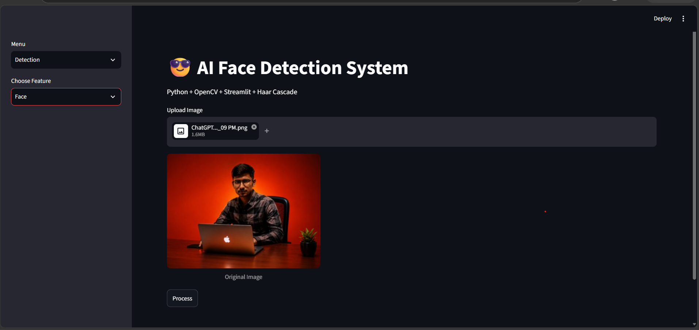
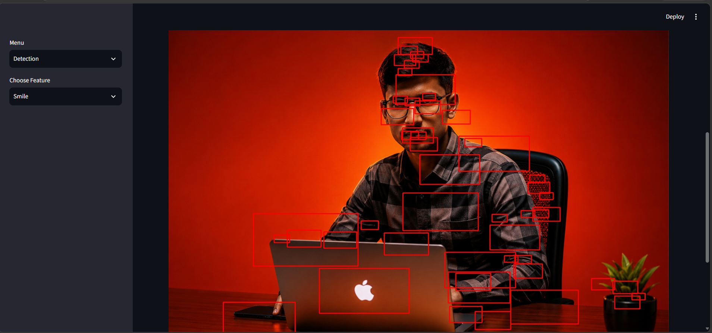
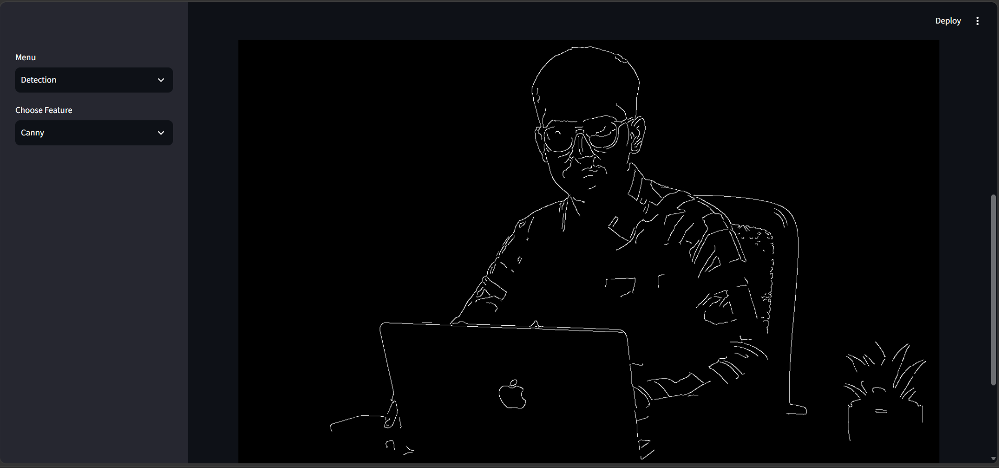

# 😎 Face Detection with OpenCV & Streamlit Web App

An AI-based Face Detection Web Application built using **Python, OpenCV, and Streamlit**.

This application performs image processing tasks using OpenCV Haar Cascade Classifier.

## 🚀 Features

✅ Face Detection  
✅ Eye Detection  
✅ Smile Detection  
✅ Cartoon Image Effect  
✅ Canny Edge Detection  

---
# 📸 Application Screenshots

## 🏠 Home Page

---

## 👤 Face Detection

The system detects human faces from uploaded images using OpenCV Haar Cascade.

---

## 👁️ Eye Detection

Detects eyes from the input image.

---

## 😁 Smile Detection

Detects smiles from human faces.

---

## 🎨 Cartoon Effect

Converts normal images into cartoon-style images.

---

## ✏️ Canny Edge Detection

Detects edges and highlights image features.

# 🛠️ Technologies Used

- Python
- OpenCV
- Streamlit
- NumPy
- Pillow
- Haar Cascade Classifier

---

# 📂 Project Structure

